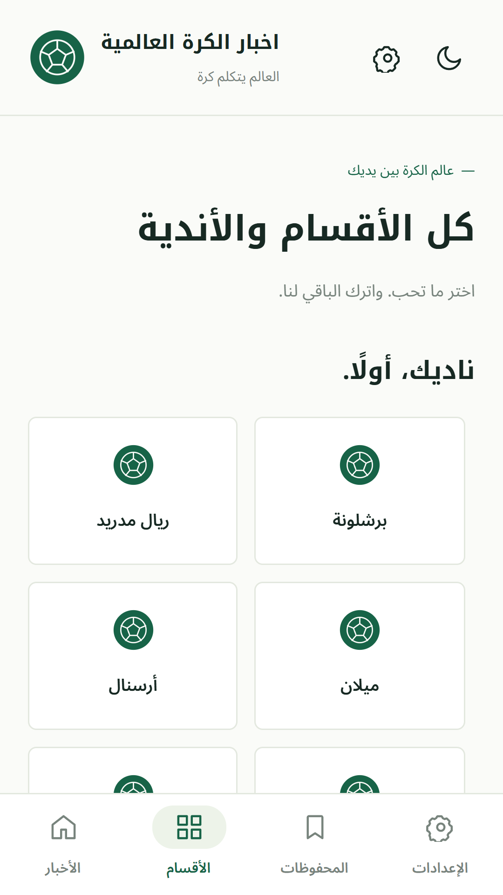
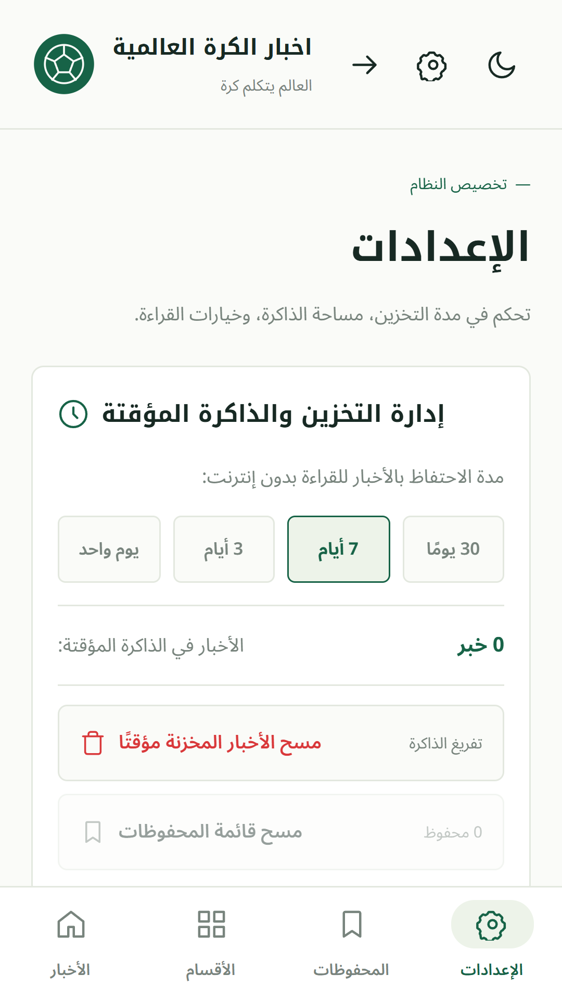

# أخبار الكرة العالمية / Akhbar Al-Kora

Actualités football en arabe via RSS **hihi2.com** : interface RTL, 25 catégories dont 14 clubs, recherche arabe, favoris, cache hors ligne, thème sombre, taille du texte et lecture vocale.

تطبيق أخبار كرة القدم بالعربية: أقسام وأندية، بحث، محفوظات، قراءة دون اتصال وقراءة صوتية. المصدر: هاي كورة.

## Développement

```bash
pnpm install
pnpm exec expo start
pnpm typecheck
pnpm lint
pnpm exec vitest run --pool=threads --no-file-parallelism --maxWorkers=1
```

Expo SDK 57 / React Native 0.86 / Expo Router / Zustand / AsyncStorage. Routes dans `src/app`, UI dans `src/components`, parsing/cache/store dans `src/lib`, comportements dans `src/hooks`.

## Notifications

Locales et facultatives. Les catégories choisies sont vérifiées pendant l'utilisation de l'accueil toutes les 3 minutes ; aucune surveillance RSS quand l'app est fermée. Le rappel fixe à **19 h, heure du téléphone**, invite à ouvrir l'app et ne contient pas un résumé téléchargé en arrière-plan. Autorisation à partir du deuxième lancement via Réglages. Les notifications locales fonctionnent dans Expo Go ; les push distants exigent un build de développement et un backend (non implémenté).

## Analytics et confidentialité

PostHog facultatif via son API HTTP, sans SDK supplémentaire. Variables publiques :

```dotenv
EXPO_PUBLIC_POSTHOG_KEY=phc_...
EXPO_PUBLIC_POSTHOG_HOST=https://eu.i.posthog.com
EXPO_PUBLIC_SENTRY_DSN=
```

Utiliser uniquement un token public de projet PostHog, jamais une clé personnelle. Sans clé ou consentement dans Réglages, aucun événement produit. Événements : `feed_view`, `feed_error`, `article_open`, `article_save`, `search`. Aucune recherche en clair ou contenu d'article ; identifiant de session temporaire, pas de replay. Révocation : annulation des requêtes en cours, aucun nouvel envoi, suppression de cet identifiant. Le prestataire reçoit toutefois l'IP lors du transport.

Sentry démarre seulement avec un DSN ; il n'est pas contrôlé par le consentement PostHog. [Politique technique](privacy-policy.md), accessible aussi en arabe depuis Réglages (`/privacy`). Avant publication, renseigner responsable/contact/rétention et héberger une version complète à une URL publique.

« Signaler un problème » ouvre une feuille de partage avec formulaire vide ; le lecteur choisit le destinataire et envoie lui-même. Aucun ticket automatique.

## Builds

```bash
pnpm exec expo install expo-dev-client # nécessaire au developmentClient
pnpm dlx eas-cli@latest build -p android --profile development
pnpm dlx eas-cli@latest build -p android --profile preview
pnpm dlx eas-cli@latest build -p android --profile production
pnpm dlx eas-cli@latest submit -p android --profile production
```

Configurer compte EAS, signing et console store avant soumission. L'URL OTA actuelle contient `YOUR_EAS_PROJECT_ID` : exécuter EAS init et remplacer ce placeholder avant build destiné aux utilisateurs.

## Store et visuels

[Descriptions FR/AR et checklist](store-listing.md). Les aperçus web mobile 1080×1920 et le bandeau 1024×500 sont dans `assets/store`. Valider/remplacer les captures sur un build natif avant soumission.




Vérifier les droits du RSS, des articles, photos et marques. L'app n'est pas présentée comme une application officielle de Hihi2.

## Performance

Objectifs à mesurer : TTI < 2 s sur Pixel 4 release, JS non compressé < 1,5 Mo par plateforme, images réseau < 200 Ko. Ce sont des budgets, pas des résultats garantis. Le downscaling réduit la mémoire de décodage, pas le téléchargement.

```bash
pnpm exec expo export --platform web --output-dir dist-perf
node scripts/check-perf.cjs dist-perf
```

Le script échoue au-delà du budget JS. Identifier les dépendances lourdes avant de relever le seuil. `feed_view.duration_ms` mesure le chargement du flux/cache, pas le TTI.
